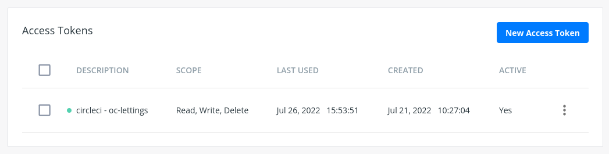
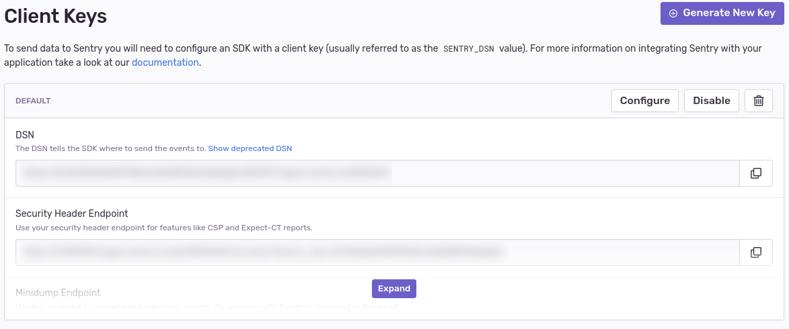
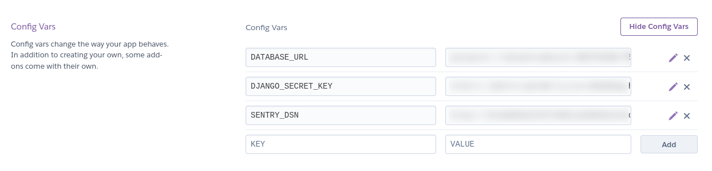
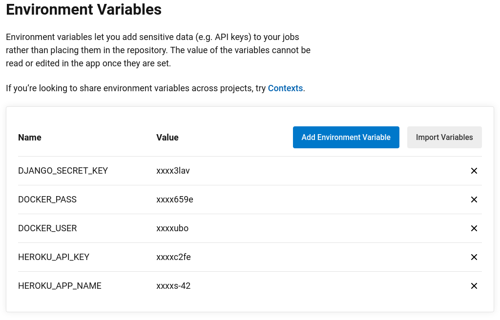

# Orange Country Lettings

## Installation et utilisation en local

### Avec python

#### Prérequis

- Git
- Python 3

#### Mettre en place l'environnement

```shell
git clone https://github.com/jogubo/oc-lettings.git
cd oc-lettings
python -m venv .venv
source .venv/bin/activate
pip install -r requirements
```

####  Base de données et migration

La BDD présente sur ce dépôt ne necessite aucune intervention.

Si vous souhaitez utiliser la BDD du projet original, il est nécessaire d'ignorer les migrations initiales 
pour `lettings` et `profiles`.
Si vous souhaitez créer une nouvelle BDD, vous pouvez ingorer cette étape et réaliser une
migrations normalement.
```shell
python manage.py migrate lettings 0001 --fake
python manage.py migrate profiles 0001 --fake
```

#### Définir les variables d'environnement

Une clef secrète est indispensable pour lancer le serveur, cette clef doit être définie en
variable d'environnement:
```shell
export DJANGO_SECRET_KEY='YOUR_SECRET_KEY'
```

Vous pouvez générer une clef et l'enregistrer dans un fichier en une commande:
```shell
python -c "from django.core.management.utils import get_random_secret_key; print(f'DJANGO_SECRET_KEY={get_random_secret_key()}')" > .env
cat .env
```

Par défaut, la configuration est pour une utilsation en production, le mode débogage peut être activé
avec la variable `DEBUG=1`


#### Lancer le serveur

Il est conseillé d'utiliser `gunicorn` pour une utilsation en production:
```shell
gunicorn --chdir src config.wsgi --log-file -
```

Pour du développement, la commande habituelle pour lancer le server:
```shell
python src/manage.py runserver
```


### Avec Docker

#### Prérequis

- Docker
- Git (si vous souhaitez construire votre image)

#### Récupérer une image

##### Directement depuis Docker Hub

Le tag `latest` correspond au dernier commit sur master, les autres tag correspondent
un hash du commit.
```shell
docker pull jogubo/oc-lettings:latest
```

##### Construire l´image depuis les sources

```shell
git clone https://github.com/jogubo/oc-lettings.git
cd oc-lettings
docker build -t oc-lettings .
```

#### Lancer le serveur

Pour utiliser l'image Docker, il faut spécifier une clef secrète en argument.
Il est également possible de changer le port et/ou lancer Django en mode débogage
```shell
docker run -p 80:5000 -e PORT=5000 -e DEBUG=1 -e DJANGO_SECRET_KEY='YOUR_KEY' jogubo/oc-lettings
```

Docker permet aussi d'utiliser un fichier `.env`.
```shell
docker run -d -p 80:8000 --env-file .env jogubo/oc-lettings
```

## CI/CD

### Prérequis

Ce repos dispose d'un fichier de configuration CircleCI, si vous souhaitez utiliser
le même workflow, voici les prérequis:
- Git
- Compte GitHub
- Compte CircleCI
- Compte Docker Hub
- Compte Heroku
- Compte Sentry (facultatif)

### Configuration

#### GitHub

Forkez ce projet.

#### Docker Hub

Récupérer un token d'accès. Il est possible de définir son mot de passe Docker Hub
en variable sur CircleCI, mais préférez l'utilisation de token pour cet usage:
**Account Settings > Security > New Access Token**



#### Sentry

La configuration permet d'utiliser Sentry pour la journalisation, vous pouvez y créer un
compter pour récupérer votre clef:
**Settings > Client Key (DSN) > DSN**



#### Heroku

Créez une application : **New > Create New App**
Puis définir les variables d'environnement de votre application:

**Settings > Config Vars**:
- `DJANGO_SECRET_KEY`: La clef secrète que vous utilisez en production 
- `SENTRY_DSN`: À renseigné si vous souhaitez récupérer les logs sur Sentry



#### CircleCI

Importez le projet dans CircleCI, une fois dans le projet, il faut en premier lieu choisir d'utiliser le fichier
de configuration présent dans la fichier `.circleci/config.yml` puis définir les variables d'environnement.

**Project Settings > Environment Variables > Add Environment Variable**:
- `DJANGO_SECRET_KEY`: utile pour les tests d'intégration, n'utilisez pas votre clef de production
- `DOCKER_USER`: votre ID sur Docker Hub
- `DOCKER_PASS`: votre token Docker Hub
- `HEROKU_API_KEY`: Votre API Key Heroku
- `HEROKU_APP_NAME`: Le nom de votre application sur Heroku



Le pipeline se lance automatiquement à chaque nouveau commit.
```
branch (all)
    |- Tests

branch (master)
    |- Tests
        |- Build Docker Image
            |- Publish on Docker Hub
            |- Deploy on Heroku
```
